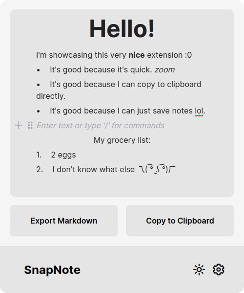
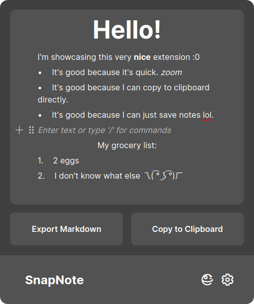

  

   <!--  -->
	
  

	<h1 align="center"><b>SnapNote</b></h1>
	

		Never skip a note.
     
    Demo: <a href="https://snapnote-demo.vercel.app"><strong>snapnote-demo.vercel.app</strong></a>
     
     
    <b>Download for </b>
    <a href="https://chromewebstore.google.com/detail/snapnote/gblgefagjalfolidiedaepbkacajaeng">Google Chrome</a> |
    <a href="https://addons.mozilla.org/en-US/firefox/addon/snapnote/">Firefox</a> | 
    <a href="https://chromewebstore.google.com/detail/snapnote/gblgefagjalfolidiedaepbkacajaeng">Edge</a>
     
  

SnapNote is an open-source note-taking extension created with the goals of transparency, convenience, and most importantly, **speed**.

Powered by the open-source block-based rich text editor [BlockNote](https://github.com/TypeCellOS/BlockNote) and, in the future, offering [Milkdown](https://github.com/Milkdown/milkdown) as an option.

 
 

## Motivation
This project was initially created with the realization that sometimes we need to take quick notes while navigating the web. We often use apps like Notion or Obsidian, but there are instances where we may not have the option to do so or, for something **quick**, lack the time to open the app and create a new note. SnapNote is designed for us, anytime, anywhere, with it installed, to take a note **immediately** in our browser and then transfer that information to our preferred apps when possible.

## Architecture
The current technologies used for this project include [CRXJS](https://github.com/crxjs/chrome-extension-tools), React, TypeScript, Tailwind CSS and Vite.
* The goal is to keep the technology stack as simple as possible to ensure we maintain the core principle of speed. However, as always, the stack is subject to change and improvement.
* For the backend, we are considering implementing Supabase to store credentials and notes. This is part of the [roadmap](ROADMAP.md) and will be implemented down the line. We are very open to feedback regarding this subject.

### Packages
* `blocknote/core` the engine containing types and elements essential for BlockNote to function.
* `blocknote/react` the React UI component library designed for blocknote/core.

## Contributing
We're delighted that you're considering contributing to this project. **Every** contribution matters, whether it's documentation, refactoring, adding new ideas/components, or anything else you believe would be a valuable addition. Please refer to the [contributing guide](CONTRIBUTING.md) for directions.

## Roadmap
The roadmap can be found [here](ROADMAP.md).
